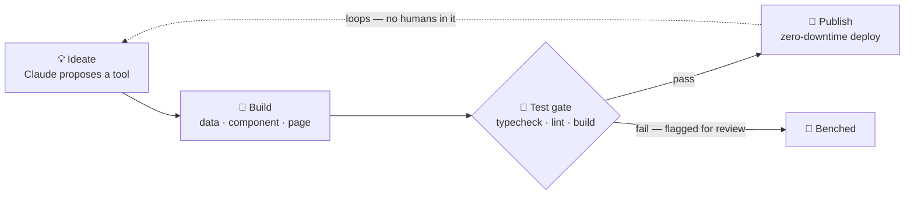

 
 

**I run [induwara.lk](https://induwara.lk) — 550+ free, no-signup tools, calculators and APIs for Sri Lanka.**

Most of them were built while I slept.

 

&nbsp;
&nbsp;

 

<a href="https://induwara.lk"><kbd>&nbsp;&nbsp;induwara.lk&nbsp;&nbsp;</kbd></a>&nbsp;&nbsp;
<a href="https://induwara.lk/tools"><kbd>&nbsp;&nbsp;Browse the tools&nbsp;&nbsp;</kbd></a>&nbsp;&nbsp;
<a href="https://induwara.lk/blog"><kbd>&nbsp;&nbsp;Read the blog&nbsp;&nbsp;</kbd></a>&nbsp;&nbsp;
<a href="https://induwara.lk/developers"><kbd>&nbsp;&nbsp;Free API&nbsp;&nbsp;</kbd></a>

 

> [!NOTE]
> Quiet contribution graph, loud shipping schedule. The real work happens in an autonomous build pipeline on my server — it doesn't sign commits here, but everything it ships is public at [induwara.lk](https://induwara.lk).

 

## What I ship

One site. 550+ tools. Instant, free, and none of them ask you to create an account.

| Category | What's inside |
|:--|:--|
| 💰 **Finance** | Income tax, EPF/ETF, loan EMI, VAT — official rates, sources cited |
| 🎓 **Education** | A/L Z-score and university admission tools |
| ⚡ **Bills** | Electricity and water tariff calculators |
| 🪪 **Utility** | NIC decoder and everyday lookups |
| 💻 **Developer** | In-browser Python, Java, C++, SQL and TypeScript compilers, plus a [free public API](https://induwara.lk/developers) |
| 🔒 **Privacy** | End-to-end encrypted, self-destructing secret chat |
| 🤖 **AI** | Website builder, diagram maker, presentation maker |

Alongside the tools: **180+ published articles** explaining the numbers behind them.

 

## How they ship themselves

The interesting part isn't any single tool — it's the factory. I designed an autonomous, Claude-powered pipeline that proposes a tool worth building, writes the code, runs the full test gate, and deploys to production with zero downtime. Around the clock, zero-touch.

My job is the part the pipeline can't do: pick the direction, verify the math against official sources, and make the factory itself better.

 

## Stack

 
 

Claude isn't an assistant in this stack — it's the workforce.

Next.js front to back. TypeScript everywhere. SQLite for everything stateful.

 

## Open source

| Repo | What it is |
|:--|:--|
| 🗂️ [**induwara-lk-free-tools**](https://github.com/IAshinsana/induwara-lk-free-tools) | The living index of every tool on induwara.lk, synced from production. **Start here.**  <code>index</code> <code>showcase</code> <code>auto-updated</code> |
| 💬 [**secret-chat**](https://github.com/IAshinsana/secret-chat) | E2EE self-destructing chat — the server only ever stores ciphertext.  <code>E2EE</code> <code>zero-knowledge</code> <code>self-destructing</code> |
| 🔥 [**one-time-secret**](https://github.com/IAshinsana/one-time-secret) | Secrets that burn after one read. A Privnote alternative.  <code>encryption</code> <code>burn-after-reading</code> |
| 📦 [**secret-file**](https://github.com/IAshinsana/secret-file) | Encrypted file sharing with the same burn-after-reading model.  <code>encryption</code> <code>file-sharing</code> |
| 🗺️ [**sri-lanka-trip-planner**](https://github.com/IAshinsana/sri-lanka-trip-planner) | Open travel data: 25 districts × 150 places.  <code>open-data</code> <code>travel</code> |
| 🧾 [**sri-lanka-tax-calculator**](https://github.com/IAshinsana/sri-lanka-tax-calculator) | Sri Lanka income tax with current IRD brackets — every rate cited.  <code>IRD-cited</code> <code>TypeScript</code> |

 

Built in Sri Lanka 🇱🇰 &nbsp;·&nbsp; Free for everyone

[Website](https://induwara.lk) · [Blog](https://induwara.lk/blog) · [API](https://induwara.lk/developers) · [Tool index](https://github.com/IAshinsana/induwara-lk-free-tools)

