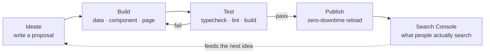

<!--
  This README is mostly generated. Every card under assets/ is written by
  scripts/generate-assets.mjs from the GitHub API and refreshed weekly by
  .github/workflows/refresh.yml. Nothing here depends on a third-party stats
  service, so no image on this page can 404 or rate-limit. See "How this
  profile works" at the bottom — it is meant to be forkable.
-->

<div align="center">


<picture>
  <source media="(prefers-color-scheme: dark)" srcset="https://raw.githubusercontent.com/IAshinsana/IAshinsana/main/assets/tagline-dark.svg">
  
</picture>

[](https://induwara.lk)
[](https://induwara.lk/tools)
[](https://induwara.lk/blog)
[](https://github.com/IAshinsana)

</div>

## Hi, I'm Induwara

I build **[induwara.lk](https://induwara.lk)** from Sri Lanka — a library of free, no-signup
online tools, calculators and developer APIs, shipped continuously by an autonomous build
pipeline I designed and run on a single 4-core box.

No accounts. No paywall. No "sign up to see your result."

- **Finance** — income tax, EPF/ETF, gratuity, loan EMI, stamp duty, VAT, fixed deposit
- **Education** — A/L Z-score, subject-combination planners
- **Bills** — electricity and water bill calculators on the current published tariffs
- **Utility** — NIC decoder, land-area converter, working-days calculator
- **Developer** — in-browser Python · Java · C++ · SQL · TypeScript compilers, plus a free public API
- **Privacy** — end-to-end encrypted, self-destructing secret chat
- **AI** — website builder, diagram maker, presentation maker

Every calculator cites its source (IRD, CBSL, CEB, gazette) and carries a `LAST_VERIFIED` date,
because a tax bracket that is quietly two years stale is worse than no calculator at all.

## What I actually ship

<div align="center">


</div>

### How the pipeline works

Four stages run head-to-tail, unattended. Claude writes the proposal and the code; the machine
decides whether it is allowed to go live.


```mermaid
flowchart LR
    A["Ideate<br/>write a proposal"] --> B["Build<br/>data · component · page"]
    B --> C["Test<br/>typecheck · lint · build"]
    C -->|pass| D["Publish<br/>zero-downtime reload"]
    C -->|fail| B
    D --> E["Search Console<br/>what people actually search"]
    E -.->|feeds the next idea| A
```

The feedback edge is the interesting one: search data picks the next tool, so the library grows
toward what people are actually looking for rather than what I find interesting on a given day.

## Tech I build with

<div align="center">


</div>

## GitHub, honestly

Small numbers. Most of my work lands in a private monorepo and comes out the other end as a live
tool rather than a starred repo — so here is the real shape of the account, straight from the API.

<div align="center">


</div>

## Open-source projects

Selected tools are extracted from the monorepo as standalone, MIT-licensed repos:

| Repo | What it is |
| --- | --- |
| [secret-chat](https://github.com/IAshinsana/secret-chat) | End-to-end encrypted, self-destructing chat — zero-knowledge, server stores ciphertext only |
| [one-time-secret](https://github.com/IAshinsana/one-time-secret) | Free Privnote alternative — paste a password, get a link that dies on first read |
| [secret-file](https://github.com/IAshinsana/secret-file) | Self-destructing encrypted file share, encrypted in the browser |
| [sri-lanka-trip-planner](https://github.com/IAshinsana/sri-lanka-trip-planner) | Open data: 25 districts × 150 places, plus the itinerary algorithm |
| [sri-lanka-tax-calculator](https://github.com/IAshinsana/sri-lanka-tax-calculator) | Sri Lanka income tax maths against the current IRD brackets, each one cited |
| [induwara-lk-free-tools](https://github.com/IAshinsana/induwara-lk-free-tools) | The full, always-current index of every live tool |

## How this profile works

Every image above except the shields.io badges is an SVG committed to **this** repo. Nothing is
fetched from a third-party stats service at page-load time, because those services die — the
previous version of this README rendered four broken images at once when three of them went down.

```
scripts/generate-assets.mjs   fetches the GitHub REST + GraphQL APIs, writes assets/*.svg
data/site-stats.json          the induwara.lk product numbers, with the date they were measured
.github/workflows/refresh.yml runs the generator weekly, commits only what changed
```

Three rules keep it from rotting:

1. **Self-hosted.** Assets live in the repo and are served from `raw.githubusercontent.com`.
   They cannot 404 and they cannot rate-limit.
2. **Frame zero is the finished picture.** GitHub renders README images inside ``, and some
   browsers freeze a SMIL timeline at `t=0`. So every number, bar width and heatmap cell is final
   in the element's own attributes; the animation is only an overlay — a sheen, a wipe, a drift.
   Freeze it at any moment and it still looks deliberate.
3. **All-or-nothing writes.** The generator builds every SVG in memory first and exits non-zero
   without touching `assets/` if any API call fails, so a flaky network can never commit a
   half-built profile.

Want it for yourself? Fork the repo, rename it to your own username, drop `data/site-stats.json`
(or fill it with your own numbers), set `GITHUB_USER`, and run:

```bash
GITHUB_TOKEN=<a token with public_repo read> node scripts/generate-assets.mjs
```

The Action needs no secret of your own — `secrets.GITHUB_TOKEN` is injected automatically.

<div align="center">


</div>
